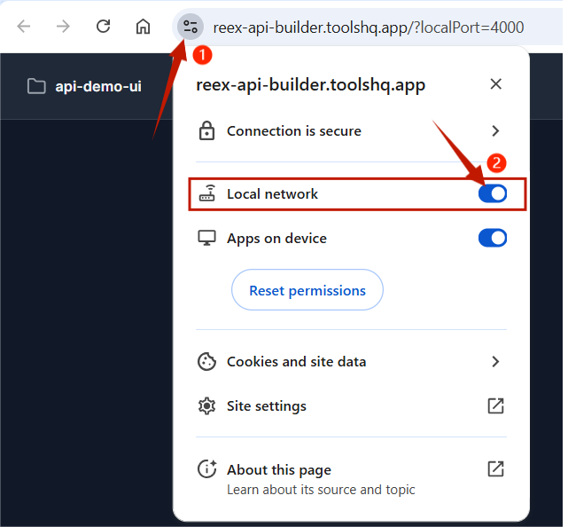

# Getting Started

Getting up and running with Reex API Builder is designed to be frictionless. The tool handles the heavy lifting of installing dependencies and setting up the required infrastructure in your React application.

### Prerequisites
Before installing, ensure your environment meets the following requirements:
- **Node.js**: Installed and configured.
- **React**: Your project must be a React-based application (e.g., Next.js, Vite, Create React App).
- **TypeScript**: Your project must be a TypeScript application.
- **Package Manager**: `npm`, `yarn`, or `pnpm`.

### Step 1: Install the CLI
Reex API Builder relies on a global CLI package to bridge the connection between the Reex API Builder (the UI) and your local project files.

Open your terminal and install the builder globally:
```bash
npm install -g reex-api-builder
```

### Step 2: Initialize Your Project & Dependency Management
Navigate to the root directory of your React project. Run the initialization command to launch Reex API Builder in Project Mode:
```bash
reex-build
```

When you run this command, Reex API Builder performs a health check on your project. It automatically detects if the required dependencies are present. If they are missing, it will install them automatically:
- **Axios**: For handling HTTP requests.
- **TanStack Query (React Query)**: For robust server state management.
- **next-auth**: For robust authentication and user session management in Next.js applications.
- **cookies-next**: For seamless cookie management on both client and server sides.

In addition to installing dependencies, this command will generate an `api-services` directory in your project root. This dedicated folder will house all of your generated API hooks, models, authentication guards, and providers.

Then, the application launches and automatically opens your browser to: **[https://reex-api-builder.toolshq.app/?localPort=4000](https://reex-api-builder.toolshq.app/?localPort=4000)**

You will be prompted by your browser to toggle your **Local network** permissions. The local network access enables communication between the Reex API Builder and your local project files.



> **Note:** You can run different projects simultaneously by switching ports with the `-p` flag. For example:
> ```bash
> reex-build -p 4002
> ```

### Step 3: Configure the Providers
Reex API Builder generates dedicated provider components to manage both the query client context and authentication. You must wrap your application with these providers to enable the generated hooks, manage API state, and handle user sessions.

1. Open your project's root file (e.g., `layout.tsx` for Next.js App Router, or `App.tsx` for standard React).
2. Import the `QueryProvider` and your chosen Auth Provider from the newly generated `api-services` directory.
3. Wrap your root layout or component with both providers.

Here is a sample provider configuration in a Next.js app:

```tsx
import "./globals.css";
import { QueryProvider } from "@/api-services/providers/QueryProvider";
import { LocalStorageAuthGuard } from "@/api-services/auth/LocalStorageAuth/LocalStorageAuthGuard";


export default function RootLayout({
  children,
}: Readonly<{
  children: React.ReactNode;
}>) {
  return (
    <html lang="en">
      <body>
        <QueryProvider>
          <LocalStorageAuthGuard> {children} </LocalStorageAuthGuard>
        </QueryProvider>
      </body>
    </html>
  );
}
```

As seen in the example, there are 2 providers to be wrapped:
- **QueryProvider**: Enables the use of TanStack queries. 
- **AuthProvider** (e.g., `LocalStorageAuthGuard`): Makes it easy to manage user sessions and authentication in the app. The auth provider will be explained in depth in the [architecture](../architecture) part of the documentation.

### Step 4: Import a Collection & Configure Authentication
Navigate to the Reex API Builder UI **[https://reex-api-builder.toolshq.app/?localPort=4000](https://reex-api-builder.toolshq.app/?localPort=4000)** and import the API collection you want to integrate.

After importing a collection, the `api-services` directory will be updated with the following:
- **`definitions/` folder**: A well-defined REST API structure based on the imported collection.
- **`generated/` folder**: React Query hooks for all REST endpoints from the definitions.
- **`types/` folder**: TypeScript type definitions for all defined endpoint responses. Types default to `unknown` until explicitly updated in the Reex API Builder UI by making a call to the endpoint and saving the interface.

**Important Note on Authentication Configuration:**
After generating your API services, you must check the `authConfig` file within your `api-services/auth` module. You are required to update specific details to match your application's authentication flow. Be sure to configure the following parameters:
- `login` URL
- `logout` URL
- `logoutMethod` GET | POST
- `refreshWithCookie` method
- `refreshWithToken` method
